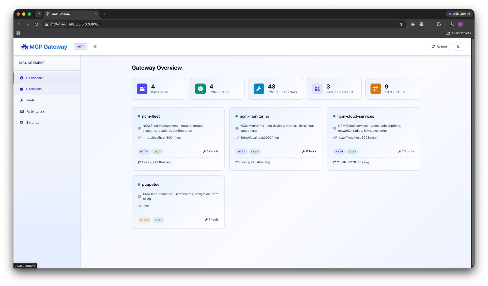

# MCP Gateway



A Python-based MCP (Model Context Protocol) proxy/gateway that consolidates multiple backend MCP servers behind a single endpoint. Built for **token optimization**, **dynamic management**, and **production reliability**.

## Key Features

| Feature | Description |
|---------|-------------|
| **Meta-Tool Mode** | Expose only 3 meta-tools instead of 43+. ~90% token savings with full capability. |
| Lazy Schema Loading | Tool schemas fetched only when called, not at discovery. 60-80% token savings. |
| Multi-Protocol | HTTP (Streamable), SSE, and Stdio backends supported |
| Dynamic Management | Add/remove backends at runtime via API or Web UI |
| Web Dashboard | Built-in UI for CRUD, monitoring, search, and backup/restore |
| Tool Filtering | Include/exclude lists per backend to control what's exposed |
| Persistent State | API-added backends survive restarts via state.json |
| Auto-Reconnect | Exponential backoff retries for disconnected backends |
| Request Logging | Per-call metrics with latency, success/error tracking |
| Authentication | Gateway API key + per-backend auth headers |
| Live Status | WebSocket feed for real-time backend status changes |
| Backup/Restore | Export and import full gateway state |

## Architecture

```
┌──────────────────┐         ┌───────────────────────────────────┐
│   AI Harness     │         │         MCP Gateway               │
│ (Kiro/Claude/etc)│────────▶│  :8080/mcp   (MCP protocol)      │
└──────────────────┘  POST   │  :8080/      (Web UI)             │
                             │  :8080/admin  (REST API)           │
                             │  :8080/ws     (WebSocket status)   │
                             └──────────────┬────────────────────┘
                                            │ routes tool calls
                              ┌─────────────┼───────────────┐
                              ▼             ▼               ▼
                       ┌──────────┐  ┌──────────┐  ┌──────────┐
                       │ HTTP srv │  │ SSE srv  │  │ stdio    │
                       │ :3001    │  │ :3000    │  │ (npx)    │
                       └──────────┘  └──────────┘  └──────────┘
```

## Quick Start

### Docker (Recommended)

```bash
cd mcp_gateway
cp config.example.yaml config.yaml   # Edit with your backends
docker compose up --build
```

### Local Development

```bash
cd mcp_gateway
pip install -r requirements.txt
python -m src -c config.yaml
```

### Connect Your Harness

Replace all individual server entries with one gateway connection:

```json
{
  "mcpServers": {
    "gateway": {
      "url": "http://localhost:8080/mcp"
    }
  }
}
```

Open `http://localhost:8080` for the management dashboard.

## Web Management UI

The built-in dashboard provides:

- **Dashboard** — Stats overview, backend cards with live status dots
- **Backends** — Add/edit/remove backends, backup/restore config
- **Tools** — Searchable list of all registered tools grouped by backend
- **Activity Log** — Real-time call history with latency and error tracking
- **Settings** — View gateway configuration status

All changes persist automatically to `state.json`.

## Configuration

### config.yaml

```yaml
gateway:
  host: "0.0.0.0"
  port: 8080
  log_level: "info"
  tool_cache_ttl: 300
  lazy_schema_loading: true
  state_file: "state.json"
  auto_reconnect: true
  reconnect_interval: 30
  api_key: "${MCP_GATEWAY_API_KEY}"  # Optional
  mode: "meta"  # "proxy" (all tools) or "meta" (3 meta-tools, ~92% token savings)

backends:
  - name: my-server
    url: "http://localhost:3000/mcp"
    transport: "http"              # http, sse, or stdio
    description: "My MCP server"
    lazy: true
    headers:                       # Auth for this backend
      Authorization: "Bearer ${MY_TOKEN}"
    tools:                         # Tool filtering
      include: ["tool_a", "tool_b"]
```

### Environment Variables

Values in config.yaml support `${VAR}` and `${VAR:-default}` syntax.

| Variable | Default | Description |
|----------|---------|-------------|
| `MCP_GATEWAY_CONFIG` | `./config.yaml` | Config file path |
| `MCP_GATEWAY_HOST` | `0.0.0.0` | Bind address |
| `MCP_GATEWAY_PORT` | `8080` | Listen port |
| `MCP_GATEWAY_LOG_LEVEL` | `info` | Log verbosity |
| `MCP_GATEWAY_API_KEY` | (none) | Required API key for access |

## Transport Protocols

| Transport | Config | Auto-Detection |
|-----------|--------|----------------|
| HTTP (Streamable) | `url: "http://.../mcp"` | Default for URL-based |
| SSE | `url: "http://.../sse"` | Auto if URL contains `/sse` |
| Stdio | `command: "npx"` + `args: [...]` | Auto if `command` is set |

Override auto-detection with explicit `transport: "http"`, `"sse"`, or `"stdio"`.

## Tool Filtering

Control which tools each backend exposes:

```yaml
backends:
  - name: fleet
    url: "http://localhost:3001/mcp"
    tools:
      include: ["get_routers", "get_groups"]  # Only these
      # OR
      exclude: ["reboot_router", "reboot_group"]  # All except these
```

Configurable via the Web UI when adding/editing a backend.

## Authentication

### Gateway API Key

When `api_key` is set in config, all requests (except `/health`, `/`, `/static`) require the key:

```bash
# Via header
curl -H "X-API-Key: your-key" http://localhost:8080/admin/backends

# Via Authorization header
curl -H "Authorization: Bearer your-key" http://localhost:8080/mcp

# Via query param
curl http://localhost:8080/admin/backends?api_key=your-key
```

### Backend Auth Headers

Each backend can have custom headers (typically for authentication):

```yaml
backends:
  - name: protected-server
    url: "http://api.example.com/mcp"
    headers:
      Authorization: "Bearer ${API_TOKEN}"
      X-Custom-Header: "value"
```

## Auto-Reconnect

When enabled, the gateway retries disconnected backends with exponential backoff:

- Base interval: `reconnect_interval` (default 30s)
- Backoff: 30s → 60s → 120s → 240s → 300s (capped at 5 min)
- Resets on successful reconnection
- Tools are re-discovered after reconnection

## Persistent State

Backends added via the Admin API or Web UI are saved to `state.json`. On restart:
1. Backends from `config.yaml` are loaded first
2. Additional backends from `state.json` are loaded (no duplicates)

## Backup & Restore

### Via Web UI
- Click **Backup** to download a JSON snapshot
- Click **Restore** to upload and apply a previous snapshot

### Via API
```bash
# Download backup
curl http://localhost:8080/admin/backup > backup.json

# Restore from backup (replaces all current backends)
curl -X POST http://localhost:8080/admin/restore \
  -H "Content-Type: application/json" \
  -d @backup.json
```

## API Reference

### MCP Protocol

| Endpoint | Method | Description |
|----------|--------|-------------|
| `/mcp` | POST | MCP JSON-RPC protocol endpoint |

### Web & Health

| Endpoint | Method | Description |
|----------|--------|-------------|
| `/` | GET | Web management dashboard |
| `/health` | GET | Health check (no auth required) |
| `/ws/status` | WebSocket | Live backend status events |

### Admin API

| Endpoint | Method | Description |
|----------|--------|-------------|
| `/admin/backends` | GET | List all backends with metrics |
| `/admin/backends` | POST | Add a new backend |
| `/admin/backends/{name}` | DELETE | Remove a backend |
| `/admin/refresh` | POST | Force re-discovery of all tools |
| `/admin/tools` | GET | List all registered tools |
| `/admin/metrics` | GET | Aggregated call metrics |
| `/admin/logs` | GET | Recent tool call log |
| `/admin/backup` | GET | Download state backup |
| `/admin/restore` | POST | Restore state from backup |

### Add Backend (POST /admin/backends)

```json
{
  "name": "my-server",
  "url": "http://localhost:3000/mcp",
  "transport": "http",
  "description": "My server description",
  "lazy": true,
  "headers": {
    "Authorization": "Bearer token123"
  },
  "tools": {
    "include": ["tool_a", "tool_b"]
  }
}
```

## How Lazy Loading Works

1. On connection, the gateway calls `tools/list` on each backend
2. It caches **only** `name` + `description` — no `inputSchema`
3. Your harness sees a minimal tool listing (huge token savings)
4. When a tool is called, the gateway routes it directly — schemas aren't needed for routing

## Meta-Tool Mode (Maximum Token Savings)

Meta-tool mode is the most aggressive token optimization. Instead of exposing all upstream tools to the LLM (even with lazy loading, each tool still consumes ~150 tokens of schema in the system prompt), meta mode exposes only **3 generic tools**:

| Meta-Tool | Purpose |
|-----------|---------|
| `mcp_gateway_discover` | Find tools by backend or keyword — returns names + descriptions |
| `mcp_gateway_describe` | Get full parameter schema for a specific tool (on-demand) |
| `mcp_gateway_execute` | Call any upstream tool by name with arguments |

### Token Comparison

| Mode | Tools in Context | Approx. Tokens | Savings |
|------|-----------------|---------------|---------|
| No gateway (4 servers) | 43 full schemas | ~6,500 | — |
| Proxy mode | 43 (lazy, no schemas) | ~4,500 | ~30% |
| **Meta mode** | 3 meta-tool schemas | ~500 | **~92%** |

### How It Works

```
LLM                        Gateway                    Upstream Servers
 │                           │                              │
 │─ discover(query="radio")──│                              │
 │                           │── (searches internal registry)│
 │◀─ get_radios, manage_radio│                              │
 │                           │                              │
 │─ describe("get_radios") ──│                              │
 │                           │── tools/list ───────────────▶│
 │◀─ {radio_id, network...} │◀─────────────────────────────│
 │                           │                              │
 │─ execute("get_radios",    │                              │
 │    {network: "..."})     ─│── tools/call("get_radios")──▶│
 │◀─ [radio results]        │◀─────────────────────────────│
```

### Configuration

```yaml
gateway:
  mode: "meta"    # "proxy" (default) or "meta"
```

The gateway still connects to all backends and discovers all tools internally — it just doesn't expose them to the client. Switch back to `mode: "proxy"` at any time without losing functionality.

## Project Structure

```
mcp_gateway/
├── src/
│   ├── __init__.py
│   ├── __main__.py        # CLI entrypoint
│   ├── config.py          # YAML + env var config, ToolFilter, BackendServer
│   ├── meta_tools.py      # Meta-tool definitions + dispatcher (discover/describe/execute)
│   ├── transport.py       # HTTP, SSE, and Stdio transports with auth headers
│   ├── registry.py        # Tool registry, metrics, auto-reconnect, WebSocket events
│   ├── persistence.py     # State file management, backup/restore
│   └── server.py          # MCP + Admin API + Auth middleware + WebSocket + Web UI
├── static/
│   ├── index.html         # Web dashboard
│   ├── css/style.css      # UI styles
│   ├── js/app.js          # Frontend logic (CRUD, search, WS, backup)
│   └── libs/              # jQuery, Font Awesome (vendored)
├── config.yaml            # Active config
├── config.example.yaml    # Full reference config
├── .env.example           # Environment variable reference
├── Dockerfile
├── docker-compose.yaml
└── requirements.txt
```

## Docker

```bash
cp config.example.yaml config.yaml
cp .env.example .env
docker compose up --build
```

The container uses `host.docker.internal` to reach services on the host network. Mount `config.yaml` as a volume for editing without rebuild.
